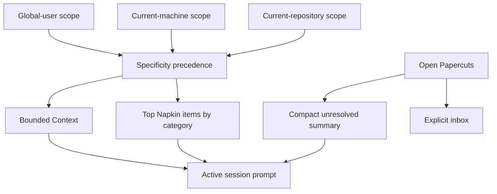
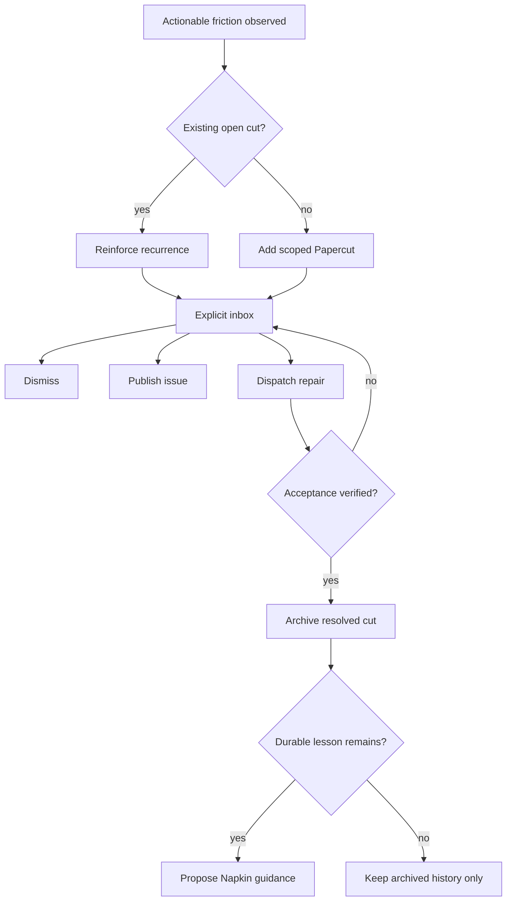
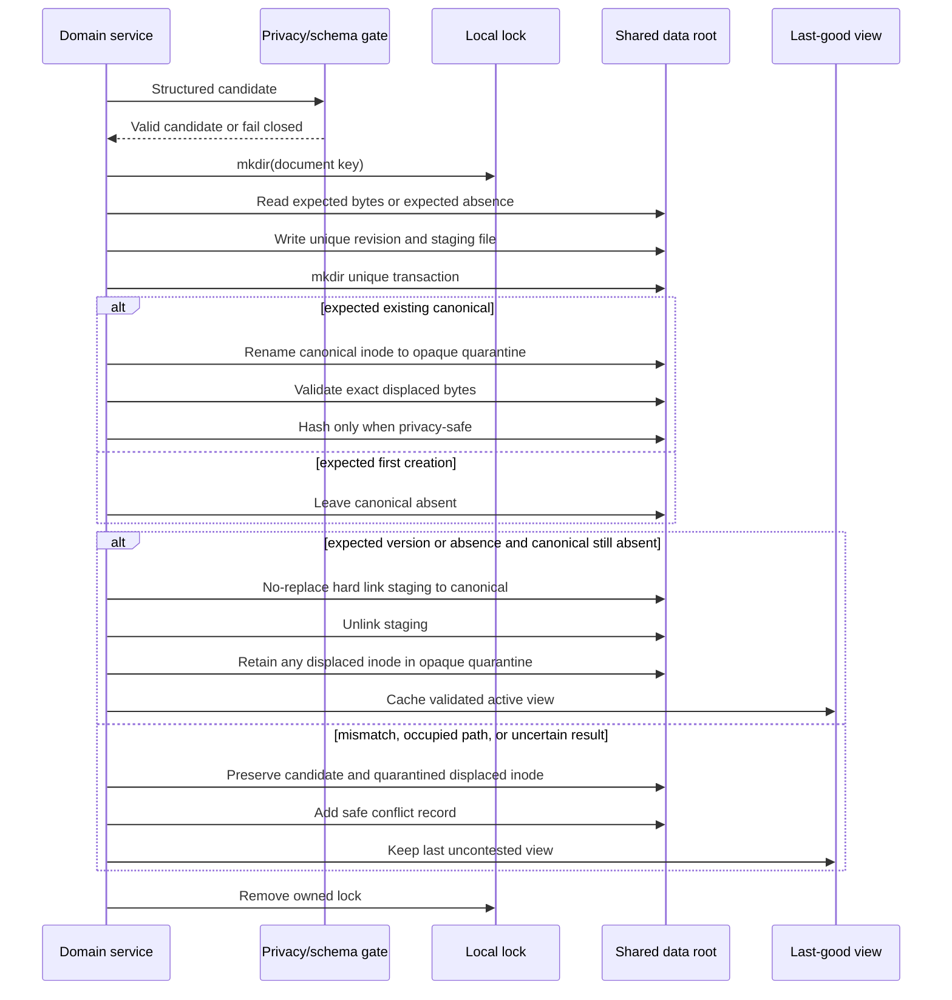
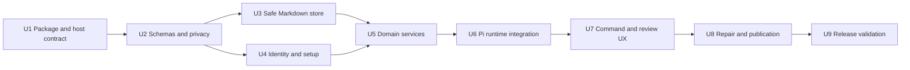

# clasi (continuous learning and self-improvement) - Plan

## Goal Capsule

- **Objective:** Build clasi, a public OMP-first Pi extension that quietly maintains useful Context, Napkins, and Papercuts across repositories, worktrees, and machines.
- **Product authority:** This contract defines the first public release for one technical user working across several machines; public discovery is supported, but team collaboration is not the target.
- **Open blockers:** None.
- **Execution profile:** Implement a new standalone public plugin repository from the package root described below; no OMP core changes are planned.
- **Stop conditions:** Stop rather than ship if clasi writes, derives, copies, or injects excluded source data; a concurrent write can silently discard a version; or required WSL, macOS, and native Windows smoke tests have not passed.
- **Tail ownership:** The implementation run owns focused tests, package diagnostics, platform smoke evidence, public installation instructions, and removal of abandoned attempts.

---

## Product Contract

### Summary

clasi reduces repeated agent mistakes and wasted context by maintaining bounded, scope-aware guidance in human-readable Markdown.
It will capture actionable friction as a quiet local inbox that can produce verified repairs without interrupting the task that exposed it.

### Problem Frame

Repo-local napkins created inside short-lived Paseo worktrees disappear when those worktrees are removed or never merged.
New sessions therefore repeat known mistakes, spend tokens rediscovering environment and repository behavior, and work around the same product gaps instead of closing them.
The user also works across WSL, macOS, and native Windows machines, so machine facts and durable personal preferences need different scopes while repository lessons need a stable identity independent of a checkout path.

### Actors

- A1. **Primary user:** Installs the public plugin across personal machines, reviews proposals and Papercuts when useful, and controls any external file synchronization.
- A2. **Active coding agent:** Receives bounded Context and Napkin guidance, records safe durable lessons, and captures actionable friction without interrupting the current task.
- A3. **Repair agent:** Receives a selected Papercut, works in an isolated worktree when available, and returns evidence for acceptance verification.
- A4. **External sync transport:** Optionally moves the configured shared root between machines without becoming part of the plugin's product contract.

### Key Decisions

- **Three concepts with explicit scope.** Context holds stable facts and preferences, Napkins hold reusable working guidance, and Papercuts hold unresolved actionable friction. Each item resolves against global-user, machine, or repository scope. (session-settled: user-directed — chosen over one tagged ledger or one Markdown hierarchy: the concepts need different mutation and review lifecycles.)
- **Two-root user registry.** Canonical Markdown lives in a configurable shared data root, while machine-local control state remains under the OMP profile; neither is committed inside a checkout. (session-settled: user-directed — chosen over Git-common-directory, committed-repo, or built-in remote storage: worktrees and machines need continuity without branch noise or a sync service.)
- **Stable repository identity.** Repository scope uses normalized canonical `origin` forge, owner, and repository coordinates; forks remain distinct, repositories without a remote receive a persisted local UUID, and remote changes require explicit migration. (session-settled: user-directed — chosen over clone-local identity, user aliases, or content fingerprints: separate clones must converge without attaching memory to the wrong repository.)
- **Most-specific guidance wins.** Repository guidance overrides machine guidance, which overrides global-user guidance, while contradictions remain visible during review. (session-settled: user-directed — chosen over newest-wins, inject-all, or mandatory manual resolution: deterministic specificity preserves repository constraints without prompt-time ambiguity.)
- **Split mutation trust by consequence.** Safe machine detection, bounded Napkin curation, and actionable Papercut capture may happen automatically; personal preferences, conflict resolution, and destructive state changes require review. (session-settled: user-directed — chosen over direct writes everywhere, proposal-only learning, or per-store trust configuration: continuous improvement must not turn mistaken beliefs into silent authority.)
- **Layered bounded context.** Sessions receive applicable global-user, current-machine, and current-repository Context plus the winning category-bounded Napkin guidance across those scopes; Papercuts contribute only a small unresolved summary until explicitly opened. (session-settled: user-directed — chosen over injecting everything, omitting Papercut awareness, or retrieving all memory on demand: token efficiency requires both bounded injection and reliable awareness.)
- **Category-bounded Napkins.** Each category exposes only its highest-value items, with displaced history retained outside active prompt context. (session-settled: user-directed — chosen over a token budget, time-based expiry, or uncapped curation: category limits are easier to inspect and reason about.)
- **Actionable Papercuts and explicit repair.** The plugin captures only friction with a plausible prevention or fix, merges repeats, and leaves review, issue publication, repair dispatch, dismissal, and closure under explicit user control. (session-settled: user-directed — chosen over logging every surprise, severity-only capture, automatic issue creation, or opportunistic repairs: the inbox must improve products without becoming noise or scope creep.)
- **Conditional resolution learning.** A resolved Papercut is archived and proposes a Napkin lesson only when future agents still need guidance after the root fix. (session-settled: user-directed — chosen over always distilling, archive-only behavior, or deletion: fixed defects must not leave obsolete workarounds in prompt context.)
- **Mutable Markdown with fail-safe conflicts.** Context and Napkins remain directly readable and editable Markdown documents; writes use safe local coordination and preserve both versions when external changes conflict. (session-settled: user-directed — chosen over append-only records, a local memory service, semantic auto-merge, or single-writer restrictions: human readability is preferred without permitting silent data loss.)
- **OMP-first, Pi-native public package.** The first release targets OMP through Pi extension APIs and plain Markdown rather than broad harness adapters. (session-settled: user-directed — chosen over a private personal system, a team product, or cross-harness compatibility from day one: public packaging primarily supports repeat installation and discovery.)
- **Quiet operation.** Routine capture and curation stay in the background; normal sessions show only a compact unresolved count, with immediate interruption reserved for blockers or unsafe storage attempts. (session-settled: user-directed — chosen over startup reviews, end-of-session digests, or periodic reminders: getting in the way is an uninstall condition.)
- **Local impact reporting.** The plugin reports context size, recurrence, backlog movement, time-to-close, and explicit Napkin hits without remote telemetry or retained conversation content. (session-settled: user-directed — chosen over qualitative-only success, health-only reporting, or anonymous telemetry: efficiency should be visible without weakening privacy.)

### Concept and Scope Model



The active session applies repository-over-machine-over-global precedence independently to Context and Napkin guidance.
Papercut details remain outside the prompt until the user or agent explicitly opens the inbox or selects a record.

### Requirements

**Storage, identity, and scope**

- R1. The plugin must provide global-user, machine, and repository scopes for Context, Napkins, and Papercuts.
- R2. The plugin must keep canonical state in a user-level shared data root that is independent of any working-tree path; machine-local control state must remain outside that synchronized root.
- R3. The shared data root must be configurable so a user can place it under an external synchronization mechanism without making that mechanism a plugin dependency.
- R4. All worktrees and separate clones of the same normalized canonical `origin` identity must resolve to the same repository scope within one shared data root.
- R5. Forks with different canonical owner or repository coordinates must resolve to distinct repository scopes.
- R6. A repository without a canonical remote must receive a persisted local UUID and must not be assumed identical to a no-remote repository on another machine.
- R7. A canonical remote change must never silently reattach existing memory; the plugin must offer an explicit migration or retain the prior identity.
- R8. Repository-scoped guidance must override conflicting machine-scoped guidance, and machine-scoped guidance must override conflicting global-user guidance.
- R9. Scope conflicts must remain inspectable even when precedence determines the active value.

**Context and onboarding**

- R10. Initial setup must use a short onboarding flow that creates high-signal global Context and safe machine Context without requiring a full personal profile.
- R11. Onboarding must optionally import existing context or instruction files as reviewable proposals rather than trusted facts.
- R12. Machine Context must support safe detection of operating-system boundaries, architecture, WSL or container status, shell and tool managers, filesystem conventions, and resource profile.
- R13. Machine detection must normalize paths and identifiers so usernames, hostnames, addresses, serial numbers, and other PII are not retained.
- R14. User-authored personal preferences must require approval before entering active Context.
- R15. The active prompt must include only Context applicable to the current global-user, machine, and repository scopes.

**Napkin behavior**

- R16. Each scope's Napkin must organize reusable guidance into categories with a configurable maximum number of active items per category.
- R17. Automatic Napkin updates must merge equivalent lessons, reinforce recurring lessons, and demote displaced items without deleting history silently.
- R18. A Napkin item must state the observed situation and the preferred future action rather than preserve a transcript or raw failure output.
- R19. Low-risk Napkin curation may write directly while retaining an inspectable activity history.
- R20. New OMP sessions launched from any worktree must receive the same active repository Napkin for the resolved repository identity.

**Papercut behavior**

- R21. The active agent must automatically capture retries, dead ends, workarounds, misleading documentation, recurring corrections, and observed product gaps only when it can state a concrete prevention or fix.
- R22. Repeated instances of the same friction must reinforce one open Papercut with recurrence metadata instead of creating duplicate inbox items.
- R23. Every Papercut must carry a scope, severity, concise derived lesson, proposed prevention or fix, lifecycle state, and safe provenance metadata.
- R24. Papercut capture must not interrupt the current task unless the cut blocks progress or an attempted write violates privacy rules.
- R25. Normal prompt context must expose only a bounded unresolved summary rather than Papercut bodies.
- R26. The explicit inbox must support inspecting, dismissing, publishing, dispatching, and resolving selected Papercuts.
- R27. Publishing a Papercut as a GitHub issue must be an explicit action and must never make GitHub the canonical local store.
- R28. Dispatching a repair must prefer a fresh Paseo worktree when available and must provide a non-Paseo Pi or OMP fallback without blocking ordinary plugin use.
- R29. A repair-dispatched Papercut must resolve only after its acceptance condition is verified; user dismissal must remain distinct from verified resolution.
- R30. Resolution must archive the Papercut and propose Napkin distillation only when a durable post-fix lesson remains.



**Prompt efficiency and quiet operation**

- R31. The plugin must inject bounded Context and category-bounded Napkin guidance without loading full history.
- R32. The plugin must remain silent during successful routine loading, capture, and curation.
- R33. The plugin must provide an explicit review command or equivalent interaction for Context proposals, Napkin history, Papercuts, and conflicts.
- R34. Immediate notifications must be limited to blockers, unsafe retention attempts, store corruption, or write conflicts that would otherwise risk data loss.

**Privacy and safety**

- R35. The plugin must not ingest, serialize, copy, derive, or inject PII, secrets, customer data, prompts, or terminal output into clasi-authored documents or metadata. Because arbitrary derived prose cannot be proven semantically safe, clasi must document that limit and apply strict minimization, pattern scanning, named-entity reduction, and source classification as defense in depth. A pre-existing or concurrently written external file may be moved inode-preserving into opaque quarantine solely to satisfy R42; it is user-controlled content, never active memory. (session-settled: user-directed — chosen over review-gating every free-text lesson: quiet automatic learning is the core behavior, and semantic privacy detection cannot be absolute.)
- R36. Terminal output is categorically excluded from clasi-authored state; the plugin may retain only a generalized derived lesson and separately classified safe metadata such as command name or exit status.
- R37. Raw environment dumps, source excerpts, and unclassified evidence must be rejected rather than redacted into clasi-authored state. Opaque quarantined external inodes are not parsed, injected, copied, published, or treated as evidence.
- R38. Privacy validation must run before clasi-authored durable writes, fail closed for content it identifies as excluded, and preserve the user's active task when safe to do so.
- R39. The plugin must not send Context, Napkins, Papercuts, or usage data to remote telemetry.

**Concurrency and portability**

- R40. Same-machine writes must use local coordination and atomic replacement so concurrent agents do not partially overwrite mutable Markdown.
- R41. A writer must detect when a document changed after it was read and must not overwrite the newer version silently.
- R42. On a detected external conflict, the plugin must preserve both versions, keep the last uncontested active view, and add a reviewable conflict without attempting semantic auto-merge.
- R43. Durable Context, Napkins, Papercuts, proposals, archives, and conflicts must remain human-readable Markdown.
- R44. The first public release must support and smoke-test WSL, macOS, and native Windows behavior.
- R45. Native Linux may work through the Pi runtime but is not a first-release support or release-gating requirement.

**Impact reporting**

- R46. A local impact report must show injected context size, repeated-friction counts, Papercuts opened and closed, time-to-close, and explicit Napkin hits when the agent cites remembered guidance.
- R47. Impact reporting must distinguish directly observed measurements from inferred benefits and must not claim avoided tokens or faster solutions without evidence.
- R48. Impact metadata must not contain conversation text, terminal output, file contents, or identifiers excluded by the privacy contract.

### Key Flows

- F1. **First installation and onboarding**
  - **Trigger:** After enabling clasi on a new machine, A1 explicitly runs `/clasi setup`.
  - **Actors:** A1, A2
  - **Steps:** clasi detects safe machine facts, asks a short set of Context questions, optionally stages validated imports as proposals, selects a shared data root, previews every staged change, and commits only after one final approval.
  - **Outcome:** The first normal session starts with bounded global-user and current-machine Context; cancellation leaves no active setup, and mixed-validity imports report skipped items without activating them.
  - **Covered by:** R2-R3, R10-R15, R35-R39
- F2. **Session context assembly**
  - **Trigger:** An OMP or compatible Pi session starts or changes repository identity.
  - **Actors:** A2
  - **Steps:** The plugin resolves user, machine, and repository scopes; applies specificity precedence; selects top Napkin items by category; and adds only the compact Papercut summary.
  - **Outcome:** The agent receives relevant prior knowledge without loading full history or a worktree-local scratchpad.
  - **Covered by:** R1-R9, R15-R20, R25, R31-R32
- F3. **Continuous Context and Napkin learning**
  - **Trigger:** A2 identifies a safe, durable fact or reusable lesson during work.
  - **Actors:** A1, A2
  - **Steps:** The plugin classifies concept and scope, rejects detected excluded data, activates only safe machine facts directly, queues every other Context change for review, and merges or ranks low-risk Napkin guidance.
  - **Outcome:** Future sessions improve without turning every observation into active prompt content.
  - **Covered by:** R8-R9, R14, R16-R19, R31, R35-R42
- F4. **Papercut capture and recurrence**
  - **Trigger:** A2 encounters actionable friction or observes a fixable product gap.
  - **Actors:** A2
  - **Steps:** The plugin derives a safe summary, classifies scope and severity, checks for an equivalent open cut, and either reinforces it or creates a new inbox item.
  - **Outcome:** The task continues while the product gap remains owned and reviewable.
  - **Covered by:** R21-R25, R32, R35-R39
- F5. **Papercut review and repair**
  - **Trigger:** A1 opens the inbox and selects a Papercut.
  - **Actors:** A1, A2, A3
  - **Steps:** A1 dismisses, publishes, or dispatches the cut; A3 performs a bounded repair; the acceptance condition is verified; and the plugin archives the result with optional Napkin distillation.
  - **Outcome:** Product and workflow gaps close without opportunistic scope creep in the session that discovered them.
  - **Covered by:** R26-R30
- F6. **Shared-root conflict handling**
  - **Trigger:** A2 attempts to save a mutable document changed by another agent, machine, or sync transport.
  - **Actors:** A1, A2, A4
  - **Steps:** The plugin refuses the overwrite, preserves both versions, retains the last uncontested active view, and adds one conflict to explicit review.
  - **Outcome:** No learning is silently lost and normal work continues unless safe persistence is impossible.
  - **Covered by:** R33-R34, R40-R43

### Acceptance Examples

- AE1. **Covers R4, R20.** Given two Paseo worktrees from one clone, when each starts OMP, then both receive the same repository Napkin without copying a file into either worktree.
- AE2. **Covers R4.** Given separate clones on two machines with the same normalized canonical `origin` and a synchronized shared root, when each starts OMP, then both resolve the same repository scope.
- AE3. **Covers R5.** Given an upstream repository and a personal fork with different owner coordinates, when each starts OMP, then their Napkins and Papercuts remain distinct.
- AE4. **Covers R6.** Given two unrelated no-remote repositories with similar contents, when the plugin initializes them, then each receives a different persisted local UUID.
- AE5. **Covers R7.** Given a repository whose canonical remote changes, when a session starts, then the plugin retains the prior attachment and requests explicit migration instead of silently switching memory.
- AE6. **Covers R8-R9.** Given a global preference for one package manager and a repository requirement for another, when context is assembled, then the repository requirement is active and the contradiction remains inspectable.
- AE7. **Covers R21-R22.** Given an agent encounters the same misleading test command three times, when it captures the friction, then one Papercut shows three occurrences rather than three inbox items.
- AE8. **Covers R24-R25, R32.** Given a minor actionable Papercut is captured during a task, when capture succeeds, then the agent continues without a notification and later sessions receive only the bounded unresolved summary.
- AE9. **Covers R29-R30.** Given a repair removes the root cause of a Papercut, when its acceptance condition passes, then the cut is archived and no obsolete workaround enters the Napkin.
- AE10. **Covers R30.** Given a repaired issue still requires a durable operating constraint, when verification passes, then the plugin proposes that constraint as Napkin guidance instead of copying the Papercut narrative.
- AE11. **Covers R35-R38.** Given candidate memory contains detected terminal output, a known secret format, classified customer data, or recognizable PII, when the plugin validates the write, then it rejects the retained content and stores no excerpt or candidate-derived artifact.
- AE12. **Covers R40-R42.** Given two machines edit the same synchronized Napkin before either sees the other's change, when the second write detects divergence, then both versions survive and the plugin does not choose or merge them silently.
- AE13. **Covers R28-R29.** Given Paseo is available and A1 dispatches a cut, when repair begins, then A3 works in a fresh worktree and the cut stays open until its acceptance condition is verified.
- AE14. **Covers R46-R48.** Given several sessions have used the plugin, when A1 opens the impact report, then it shows local counts and context size without conversation text, terminal output, or unsupported claims of avoided tokens.

### Success Criteria

- A new worktree begins with the same relevant repository guidance as existing worktrees and does not create a fresh Napkin from scratch.
- A synchronized second machine resolves the same global-user and repository scopes while keeping machine-specific guidance distinct.
- Known recurring friction is recognized or reinforced without repeating the original discovery process.
- Active Context and Napkins remain bounded, categorized, and materially smaller than their retained history.
- Papercuts produce verified repairs, explicit dismissals, or published issues rather than an indefinitely growing complaint file.
- Routine sessions receive no modal prompts, review interruptions, or success notifications after onboarding.
- Privacy closure tests demonstrate that raw source material and detectable excluded content never land in clasi-written durable state, archives, conflicts, or impact metadata; semantic limits for generalized prose remain explicit.
- Local reports expose observed context cost, recurrence, and closure behavior without claiming causality that cannot be measured.

### Scope Boundaries

**Deferred for later**

- Built-in synchronization transport, private Git synchronization, or a hosted memory service.
- Team-shared Context governance, approvals, and organization-wide repository memory.
- Native Linux as a release-gating platform.
- Dedicated adapters for non-Pi agent harnesses.
- Automatic repair scheduling and automatic GitHub issue creation.
- Cryptographic revision signing or authentication of writers in a hostile or compromised sync root.

**Outside this product's identity**

- A conversation recorder, terminal-output archive, observability collector, or telemetry service.
- A secret manager, customer-data store, or personal knowledge base for non-coding activity.
- A replacement for GitHub Issues or the repository's normal product-planning system.
- An agent that interrupts current work to fix unrelated friction opportunistically.

### Dependencies and Assumptions

- OMP and Pi extension APIs can inject bounded session context, register commands or tools, observe lifecycle events, and access current-session context usage without requiring an OMP core fork.
- Paseo repair dispatch is optional; the plugin remains functional when Paseo is absent.
- External sync tools eventually copy files but do not provide transactional cross-machine locking, so divergence detection and preservation remain plugin responsibilities.
- Canonical remotes can be normalized for common forge URL forms without treating forks as the same repository.
- Markdown remains the canonical state even when planning introduces indexes or ephemeral caches for efficient lookup.
- The selected shared data root and sync account are trusted for integrity and support same-directory hard links; clasi fails writable setup rather than weakening these assumptions.
- Privacy classification of generalized prose is defense in depth, not a proof that every unknown customer name or ordinary-word secret will be recognized.


### Sources and Research

- [Napkin](https://github.com/blader/napkin) — per-repository curated memory that compounds across sessions.
- [Frog](https://github.com/wevm/frog) — actionable friction lifecycle from capture through issue ownership and verified removal.
- [Papercuts](https://github.com/treygoff24/papercuts) — append-safe complaint capture, recurrence, review, and resolution semantics.
- [Friction Log skill](https://github.com/aurorascharff/skills/tree/main/skills/friction-log) — criteria for recording actionable agent friction and deriving concrete improvements.
- [Creed](https://creed.md/) — global personal context, reviewable agent edits, and activity history.
- [Git `rev-parse`](https://git-scm.com/docs/git-rev-parse) — `--git-common-dir` unifies linked worktrees inside one clone but does not establish cross-clone identity.
- [OMP extension API](https://github.com/can1357/oh-my-pi/blob/main/docs/extensions.md) — extension factories, lifecycle and context events, commands, tools, managed timers, UI capabilities, and session APIs.
- [OMP extension loading](https://github.com/can1357/oh-my-pi/blob/main/docs/extension-loading.md) — package manifests, source loading, and reload behavior for public plugins.
- [OMP skills](https://github.com/can1357/oh-my-pi/blob/main/docs/skills.md) — bundled skill discovery and `skill://`-addressable supporting files.
- [OMP autonomous memory](https://github.com/can1357/oh-my-pi/blob/main/docs/memory.md) — existing `/memory` command and project-scoped memory behavior that clasi must coexist with.
- [Pi extension reference](https://github.com/badlogic/pi-mono/blob/main/packages/coding-agent/docs/extensions.md) — upstream event ordering, per-model-call context mutation, headless UI behavior, and command precedence.
- [Node.js file-system API](https://nodejs.org/docs/latest-v22.x/api/fs.html) — exclusive creation, directory creation, rename, and TOCTOU caveats behind the local write protocol.
- [proper-lockfile](https://github.com/moxystudio/node-proper-lockfile) — evaluated and rejected for the first release because automatic stale-lock recovery is unsafe around machine sleep and externally synchronized folders.

---

## Planning Contract

### Key Technical Decisions

- KTD1. **Public identity is clasi.** The repository, package, plugin, bundled skill, and standalone executable use `clasi`; the interactive command is `/clasi`, and model-callable tools use the `clasi_*` prefix. The expanded name is “continuous learning and self-improvement.” (session-settled: user-directed — chosen over `quiet-context-memory`: the broader name describes the product rather than one implementation mechanism.)
- KTD2. **clasi is a standalone Pi extension package with a shared headless CLI.** `package.json` exposes `src/index.ts` through `omp.extensions` and `bin/clasi.ts` through `bin`; both call the same domain services. The extension factory registers hooks, one interactive command, and focused tools. Runtime work begins in lifecycle handlers or the CLI entry point rather than at module import, and no OMP core fork is planned.
- KTD3. **Prompt changes use Pi's transient `context` event.** clasi prepends one typed custom message to the deep-copied message list before each model request, removes any prior clasi message first, and never edits `SYSTEM.md`, provider payloads, or private prompt templates. The active view refreshes at `session_start`, `turn_start`, session-tree changes, and successful clasi writes.
- KTD4. **Machine-local control state and synchronized user data are separate.** The control root defaults to `<PI_CODING_AGENT_DIR>/clasi` and holds configuration, a random machine UUID, local locks, a stable local repository index, and validated last-good views. The data root resolves from `CLASI_HOME`, then local configuration; setup offers `<PI_CODING_AGENT_DIR>/clasi/data` when the user does not choose an externally synchronized directory. No missing or invalid data root creates a worktree-local fallback. (session-settled: user-directed — chosen over Git-common-directory and committed repository state: worktrees and machines need continuity without branch-bound files.)
- KTD5. **Canonical documents stay mutable Markdown, with immutable revisions used only for safety and audit.** Each scope owns `context.md`, `napkin.md`, proposals, and individual Papercut Markdown files. A valid mutation first writes a uniquely named revision, then uses the lossless two-phase protocol in KTD6 to replace the canonical file without overwriting an unseen version. Revision lineage and validated last-good views preserve divergence without treating an append-only journal as the user-facing source of truth. (session-settled: user-directed — chosen over append-only canonical records and a local memory service: users must be able to inspect and edit ordinary Markdown without silent data loss.)
- KTD6. **Canonical replacement moves before it promotes.** A machine-local `mkdir` lock keyed by document ID serializes clasi writers. After validating the candidate in memory and writing a unique revision plus a same-directory staging file, the writer creates an exclusive transaction directory and atomically renames the current canonical file to `.clasi/quarantine/<transaction-id>/displaced.md`. It validates the exact displaced bytes and hashes them only when they pass the privacy gate, then installs the candidate with an atomic no-replace hard link from staging to the now-empty canonical path and immediately unlinks staging. An expected first creation skips displacement and uses the same no-replace promotion. A mismatched displaced version, a newly occupied canonical path, unsupported hard links, or any uncertain result becomes a conflict; clasi never falls back to truncation or overwrite. Displaced inodes remain opaque quarantine artifacts even after a matching safe snapshot is known, because an already-open external descriptor may write after the check; only `clasi clean-transaction <transaction-id> --confirm` may remove one after the user confirms external writers are quiescent. Stale local locks are never stolen automatically; `clasi recover-lock` requires explicit user action and proof that the same-machine owner process is gone.
- KTD7. **Strict schemas and structured inputs minimize privacy risk without claiming semantic certainty.** clasi uses an enumerated, bounded frontmatter grammar and constrained Markdown bodies rather than arbitrary YAML or Markdown AST parsing. Tools accept generalized derived fields, canonical keys, classifications, and safe counters; they never accept prompts, terminal output, raw evidence, environment dumps, or arbitrary file bodies. Validation runs before serialization and candidate-derived IDs, revisions, temporary files, conflicts, archives, metrics, or GitHub bodies. Inputs are UTF-8 with an optional BOM and LF or CRLF; writes normalize to UTF-8 without BOM and LF. (session-settled: user-directed — chosen over review-gating all free text: strict minimization and detection preserve quiet automatic learning, while unknown semantic sensitivity remains a documented residual risk.)
- KTD8. **Repository identity is a hash of normalized canonical coordinates.** clasi parses common HTTPS, `ssh://`, and SCP-like `origin` forms; lowercases the forge host and case-insensitive forge coordinates; removes transport syntax and a terminal `.git`; and hashes the canonical value before persistence. Fork coordinates remain distinct. The machine-local index prefers stable filesystem device/file identity for the Git common directory and falls back to a hashed path plus an explicit reattach flow, so a repository move does not silently strand a no-remote UUID. No-remote repositories never auto-converge across machines. Remote migration validates and copies the old scope to the new key, preserves the old scope, writes an idempotent completion marker, and refuses to merge an existing target automatically.
- KTD9. **Specificity and configurable fixed caps determine the active view.** Context and Napkin entries carry a stable logical key; repository values override machine values, which override global values for the same key, while shadowed entries remain reviewable. The initial Napkin categories are Execution, Validation, Tooling, Repository Conventions, and Domain Guardrails, with five active items per category by default. Entries are at most 240 characters, all injected material has a 6,000-character hard cap, and the Papercut contribution is count-only. `/clasi config` and `clasi config` update validated category and cap settings.
- KTD10. **Continuous learning is model-assisted but extension-enforced.** The injected protocol tells the active agent to call structured clasi tools when it derives a durable fact, reusable lesson, actionable Papercut, or explicit Napkin hit. clasi does not scrape user messages, assistant messages, or tool output. Safe machine facts may activate directly; other Context changes become proposals; bounded low-risk Napkin changes and actionable Papercuts may write directly. Exact canonical keys merge atomically, while ambiguous similarity returns candidate IDs and requires an explicit merge target instead of guessing.
- KTD11. **Papercut, repair, and publication state are separate.** Papercut lifecycle is `open`, `resolved`, or `dismissed`. An open cut has repair state `none`, `queued`, `dispatched`, `running`, `awaiting_verification`, `failed`, `indeterminate`, or `verified`, and publication state `none`, `pending`, `failed`, `indeterminate`, or `published`. The active agent prefers Paseo and a fresh worktree when available, otherwise normal Pi or OMP execution. Only `repair=verified` with publication neither `pending` nor `indeterminate` may transition the cut to `resolved`. GitHub publication uses `gh` without a shell, binds search and creation to the confirmed repository key and account, and never automatically retries `indeterminate`.
- KTD12. **Impact data is local, aggregate, and rebuildable.** Per-machine metrics store counts and durations only. Reports derive recurrence, open/closed counts, and time-to-close from current and archived Markdown; explicit Napkin hits come from deliberate `clasi_mark_hit` calls. clasi records actual injected characters and labels token counts as estimates because Pi's `getContextUsage()` excludes later `context` mutations. Corrupt or absent metrics are rebuilt where possible and otherwise labeled unavailable.
- KTD13. **Degraded startup never blocks ordinary coding.** Missing setup, unreadable roots, malformed documents, unknown newer schemas, unsafe manual content, or uncertain locks disable affected reads and writes without rewriting bytes. TUI sessions receive at most one actionable blocker notification. The standalone CLI exposes provider-free `setup-needed` and `degraded` results; OMP print mode is not treated as a slash-command surface. Routine success remains silent.
- KTD14. **The dependency floor stays small.** Runtime code uses Pi's API and Node-compatible filesystem, path, crypto, and process primitives. Native Windows root ownership additionally uses a non-shell PowerShell subprocess that returns the current SID and root ACL owner as JSON; absence, malformed output, or mismatch forces read-only mode. `@oh-my-pi/pi-coding-agent` supports the declared peer range, and Bun supplies TypeScript loading and tests. The first release does not add a lock library, YAML parser, Markdown parser, database, daemon, telemetry SDK, or GitHub SDK.
- KTD15. **clasi coexists with OMP's built-in memory.** It never registers or intercepts `/memory`, never mutates OMP memory settings, and identifies its custom message and tools distinctly. `/clasi doctor` and `clasi doctor` may report possible duplicate context when the configured host exposes enough information, but clasi does not disable another memory system.

### High-Level Technical Design

```mermaid
flowchart LR
  H[Pi lifecycle and context hooks] --> R[clasi runtime]
  T[clasi_* tools] --> R
  C[/clasi interactive command] --> R
  B[clasi headless executable] --> R
  R --> I[Identity resolver]
  R --> V[Context view assembler]
  R --> D[Context, Napkin, Papercut services]
  D --> P[Privacy and schema gate]
  P --> S[Safe Markdown store]
  S --> L[Machine-local locks and last-good cache]
  S --> M[Configurable shared data root]
  D --> X[Repair and GitHub adapters]
  D --> Q[Local impact report]
```

The extension and CLI layers are thin. Hooks, tools, commands, and `bin/clasi.ts` call the same domain services, and those services can mutate state only through the privacy-gated Markdown store. External commands run through a replaceable execution adapter so tests can prove argument handling, destination binding, retry behavior, and absence of shell interpolation.

### Durable Layout and Schemas

The implementation uses the following root-relative layout. `<scope>` is one of `global`, `machines/<machine-id>`, or `repositories/<repository-key>`.

```text
<machine-control-root>/
  config.json
  machine-id
  repo-index.json
  locks/<document-key>/
  last-good/<document-key>.md

<shared-data-root>/
  scopes/<scope>/context.md
  scopes/<scope>/napkin.md
  scopes/machines/<machine-id>/metrics.md
  scopes/<scope>/proposals/<proposal-id>.md
  scopes/<scope>/papercuts/open/<papercut-id>.md
  scopes/<scope>/papercuts/archive/<papercut-id>.md
  .clasi/revisions/<document-key>/<revision-id>.md
  .clasi/conflicts/<conflict-id>.md
  .clasi/migrations/<migration-id>.md
  .clasi/transactions/<transaction-id>/state.md
  .clasi/quarantine/<transaction-id>/displaced.md
```

Every clasi Markdown document carries fixed frontmatter fields: `schema_version`, `document_type`, `scope_type`, `scope_id`, `revision_id`, `parent_revision_id`, and `updated_at`. Type-specific keys are enumerated. Unknown keys, duplicate keys, multiline frontmatter values, unsupported schema versions, oversized fields, invalid IDs, and malformed bodies make the document inactive and read-only. The codec accepts UTF-8 with optional BOM and LF or CRLF, then writes canonical UTF-8 without BOM and LF.

Context and Napkin use separate body schemas. A Context item stores an ID, logical key, approved fact or coding preference, priority, and safe timestamps. A Napkin item stores an ID, logical key, category, priority, recurrence and hit counts, observed situation, preferred future action, and safe timestamps. Papercuts store only a generalized summary, canonical fingerprint, scope, severity, proposed prevention, acceptance condition, lifecycle transitions, recurrence counters, safe related IDs, and publication or repair state.

Before any read or write, clasi resolves and pins each root's identity, verifies containment, rejects symlinked ancestors, junctions, reparse points, special files, and ownership changes, and enforces regular-file size limits. Imports must be user-selected regular files no larger than 64 KiB and are checked before reading. clasi creates POSIX directories and files with `0700` and `0600`. On native Windows it passes the root only through a subprocess environment variable to `powershell.exe -NoProfile -NonInteractive`, compares `[System.Security.Principal.WindowsIdentity]::GetCurrent().User.Value` with `(Get-Acl -LiteralPath $env:CLASI_ROOT_CHECK).Owner` after SID translation, and fails writable mode with a safe reason code when PowerShell is absent, JSON output is malformed, containment is uncertain, or ownership does not match. Revision snapshots contain already-validated candidate bytes. Conflict records contain safe revision and transaction IDs, while displaced external bytes remain isolated and uninjected until validation.

### Write and Conflict Sequence



The transaction sequence closes the check-then-rename overwrite race: clasi first moves the exact current canonical inode out of the destination and later creates the new path only if it is still absent. If an editor or sync transport writes before the move, its bytes move unchanged into opaque quarantine; if it creates a replacement after the move, exclusive promotion fails. An external descriptor opened before the move may still mutate the quarantined inode afterward, so automatic reconciliation never unlinks or reclassifies it based on a point-in-time check. `clasi clean-transaction <transaction-id> --confirm` removes one retained artifact only after warning the user to quiesce editors and sync clients. Each individual rename, directory creation, and hard-link creation is atomic on supported roots. A root without same-filesystem rename and same-directory hard-link support is read-only in the first release.

Startup reconciliation activates a canonical revision only when its lineage has one head and the document passes privacy and schema checks. Missing or partial canonical state is recovered from validated safe candidates without overwriting a newly occupied path. Quarantined external bytes are never active, injected, copied, published, or hashed unless a validation pass first classifies the current bytes as safe; unsafe or changing bytes remain opaque for explicit user recovery or cleanup.

### Context Assembly

For each model request, the cached active view resolves the current repository and machine, groups Context and Napkin entries by logical key, applies repository-over-machine-over-global precedence, and ranks remaining entries deterministically by priority, explicit approval, recurrence or hit count, recency, and ID. It then serializes one custom `clasi-context` message under the hard character cap. If the cap is reached, lower-ranked items are omitted; history is never loaded to fill unused categories.

The custom message contains:

- approved global, machine, and repository Context applicable to the session;
- the winning active Napkin items, grouped by category and annotated with stable item IDs;
- the number of open Papercuts by severity, without Papercut bodies;
- a short operating contract telling the agent when to call clasi tools, how scope precedence works, and that current user instructions and repository state remain authoritative.

### Onboarding, Review, and Degraded Modes

`/clasi setup` is the interactive onboarding flow: it selects or creates the shared root, shows normalized safe machine facts, asks at most one global coding-default question and one machine-specific question, and optionally stages a user-selected instruction file. It ends with a summary followed by Commit or Cancel; configuration is written last. Provider-free `clasi setup` is intentionally one-shot: it accepts `--root <path> --confirm`, activates only validated machine facts, and returns `choice-required` with zero writes when either argument is absent. Personal questions and imports remain available through the interactive review flow rather than a persisted CLI wizard.

`/clasi` is the interactive TUI/RPC command surface; OMP print mode is not. With no arguments it orders blockers and conflicts first, then setup/status/config, review/inbox/history, and impact/doctor. List views distinguish empty from degraded state, open selected items in a detail view, return to the updated list after an action, preserve selection where possible, and provide Back/Escape at every depth. State labels are textual and numbered rather than color-only.

The standalone `clasi` executable is the provider-free noninteractive surface. Every invocation emits exactly one JSON object with `schema_version`, `status`, `code`, `message`, `data`, and `next_actions`; `status` is `ok`, `choice-required`, `setup-needed`, `degraded`, `partial`, or `error`. Exit code `0` means completed success or an empty result, `2` means user action is required, and `1` means failure. A degraded result includes only a safe reason code, affected scope and document type, disabled reads and writes, whether a last-good view is active, unaffected operations, and one recovery command.

Review and inbox flows expose loading, empty, partial/degraded, detail, action-success, and action-error states. `/clasi history` and `clasi history` reconstruct demoted Napkin items from validated revisions so R33 does not require manual revision decoding. Validated conflict detail loads two safe revisions, labels them A and B, supports sequential text comparison and active-view preview, and offers Choose A, Choose B, Keep unresolved, and Back. Opaque-quarantine conflict detail shows only safe reason, transaction ID, candidate revision ID, and canonical occupancy; it offers Revalidate quarantine, Activate safe candidate only when no canonical path is occupied, Keep quarantined, and Back. Successful revalidation copies a stable privacy-safe snapshot into a revision and converts the conflict to the validated flow; rejected or changing bytes remain opaque. Headless actions require conflict, transaction, and applicable revision IDs.


Consequential TUI actions require one final confirmation showing target and effect: preference approval, dismissal, publication, repair dispatch, verified resolution, conflict activation, repository migration, and lock recovery. Cancel is a no-op that returns to the prior view. Consequential CLI record actions require the target ID plus `--confirm`; setup requires `--root` plus `--confirm`. Missing confirmation produces `choice-required` with zero side effects. Repository migration shows safe old/new opaque identities and target existence, offers Retain prior or Migrate, leaves attachment unchanged on cancel or target conflict, and confirms the preserved old scope plus active new scope on success.

### Papercut Matching and Lifecycle

The capture tool requires a validated canonical fingerprint that describes the fixable cause without source text. Scope plus fingerprint identifies an open Papercut. Exact matches increment recurrence under the document lock. Conservative token similarity may return possible matches, but it never merges them; the caller must retry with an explicit existing ID. A recurrence after dismissal or resolution creates a new record linked to the archived record.

The inbox derives legal actions from three fields. An `open` cut with `repair=none|failed` may dispatch; `repair=queued` may cancel before acknowledgment; `dispatched|running` is read-only except for agent reports; `awaiting_verification` may verify; `indeterminate` may reconcile or explicitly resubmit; and `verified` may resolve only while publication is `none|failed|published`. Publication is available from `none|failed`, `pending` is read-only, `indeterminate` may reconcile or explicitly resubmit, and `published` exposes the issue reference. Dismissal is permitted only when neither subsystem is `queued`, `dispatched`, `running`, `awaiting_verification`, `pending`, or `indeterminate`. `resolved` and `dismissed` cuts are read-only archives.

Repair and publication have independent idempotency keys and failure reason codes. Definitive pre-effect failure enters that subsystem's `failed` state and may retry. A lost or ambiguous acknowledgment enters its `indeterminate` state and requires a new user confirmation when reconciliation cannot prove the result. Resolution is blocked until every ambiguous publication effect is reconciled, then creates a Napkin proposal only when the verifier states a durable post-fix constraint that passes normal privacy and review gates.

### System-Wide Impact

- **Prompt context:** clasi adds one bounded transient message to each model request. It never changes the system prompt or full conversation history.
- **Shared storage:** External sync remains eventually consistent. clasi supplies local serialization, lineage, lossless two-phase replacement, and preserve-both recovery rather than claiming a cross-machine transaction.
- **Host behavior:** Pi lifecycle, interactive command, UI, and tool semantics power the extension; the shared `clasi` executable owns provider-free automation. Provider credentials and model configuration are untouched.
- **Repository behavior:** clasi reads Git identity but writes no files into worktrees and does not run repairs opportunistically.
- **External systems:** Paseo and GitHub are optional explicit adapters. Their absence cannot break context loading, capture, review, the CLI, or local reporting.
- **Privacy and trust:** No telemetry leaves the machine. GitHub publication is the only clasi-initiated remote disclosure and requires a user-confirmed repository and account. The user-selected shared root and sync identity are trusted for integrity; authenticating malicious sync writers is deferred and documented.

### Risks and Mitigations

- **Semantic privacy cannot be proven by text inspection.** Restrict every write to generalized typed fields, require a safe source classification, reduce named entities, reject suspicious or unclassified content, and test sentinels through every durable path. The public contract labels this defense as best effort rather than an absolute classifier.
- **Sync transports can replay or reorder files.** Treat revision lineage as authoritative, never use sync-folder locks as distributed locks, keep validated last-good views, and surface unresolved heads rather than auto-merging.
- **The shared root is a trust boundary.** Require a user-owned private root and trusted sync account; fail closed on path escapes or ownership drift. Revision signing and hostile-sync authentication are deferred rather than implied.
- **A process can die while holding a local lock or transaction.** Keep mutations short, remove owned locks in `finally` and session shutdown, retain displaced bytes, and require explicit dead-owner recovery.
- **Pi and OMP APIs can drift.** Support `>=17.2.4 <18`, test exact `17.2.4` plus the latest resolved 17.x version, and fail installed-plugin diagnostics when required events or APIs disappear.
- **Windows filesystem behavior differs.** Accept BOM/CRLF input, normalize output, retry only documented transient sharing violations, and reject roots without the required containment and hard-link semantics.
- **Model behavior can omit a capture call.** Run ten blinded scenarios against the release model recorded in the evidence artifact and require at least eight correct capture decisions; document other tool-capable models as best effort rather than claiming deterministic parity.
- **Built-in memory can duplicate context.** Keep namespaces independent, identify clasi context clearly, and report coexistence without modifying user settings.
- **The `clasi` npm name is currently unclaimed but could change before publication.** Recheck at release time; a scoped npm name or direct Git installation may be used without changing `/clasi` or the product name.

### Sequencing



U3 and U4 may proceed independently after U2. All later units depend on their shared storage and identity contracts.

---

## Implementation Units

### U1. Establish the public package and Pi host contract

- **Goal:** Create a loadable clasi plugin package with one extension entry point, one provider-free CLI entry point, a bundled operating skill, and a deterministic fake host.
- **Requirements:** R31-R34, R39, R44-R45
- **Dependencies:** None
- **Files:** `package.json`, `bun.lock`, `tsconfig.json`, `src/index.ts`, `src/cli.ts`, `bin/clasi.ts`, `src/runtime-types.ts`, `src/exec.ts`, `skills/clasi/SKILL.md`, `test/support/fake-extension-host.ts`, `test/support/fake-exec.ts`, `test/extension-registration.test.ts`
- **Approach:** Declare `omp.extensions: ["./src/index.ts"]`, `bin.clasi`, peer support for `@oh-my-pi/pi-coding-agent >=17.2.4 <18`, Bun scripts, and no runtime dependencies. Register `/clasi`, a static test-only `context` handler contract, and the `clasi-context` message type; reserve complete tool registration for U6. Define one argument-array process runner with injectable environment and bounded JSON output for the Windows ownership check and later `gh` calls. Keep both entry modules side-effect free beyond registration or explicit CLI execution. The skill explains Context, Napkin, and Papercut judgment without becoming a runtime dependency.
- **Test Scenarios:** The fake host loads the factory once; the factory, command, context hook, message type, CLI contract, and process runner construct without running domain work; invoking the static context fixture produces one bounded message; a duplicate registration fails visibly; `/memory` remains absent; UI and no-UI contexts both construct; fake process outcomes cover spawn failure, timeout, malformed JSON, and bounded output.
- **Verification:** `bun test test/extension-registration.test.ts` and `bun run typecheck`.

### U2. Define paths, schemas, IDs, and the fail-closed privacy gate

- **Goal:** Make every durable representation deterministic, bounded, versioned, and rejectable before candidate-derived bytes are created.
- **Requirements:** R1-R3, R13-R14, R18, R23, R35-R39, R43, R48
- **Dependencies:** U1
- **Files:** `src/config.ts`, `src/paths.ts`, `src/root-safety.ts`, `src/windows-identity.ts`, `src/ids.ts`, `src/schema.ts`, `src/privacy.ts`, `src/markdown-codec.ts`, `test/schema.test.ts`, `test/privacy.test.ts`, `test/root-safety.test.ts`, `test/fixtures/privacy-sentinels.ts`
- **Approach:** Implement the two-root layout, home-relative placeholders, opaque IDs, separate Context and Napkin schemas, strict frontmatter parsing, UTF-8/BOM/newline normalization, maximum sizes, and enumerated source classifications. Pin root identity, containment, ownership, and regular-file invariants before I/O. On Windows, invoke the fixed PowerShell SID/ACL-owner probe through U1's non-shell runner with the candidate path only in `CLASI_ROOT_CHECK`; reject missing PowerShell, non-JSON output, SID translation failure, or mismatch. Privacy validation generalizes and scans structured fields in memory, returns safe reason codes, and creates no derivative for rejected candidates; semantic limitations remain explicit.
- **Test Scenarios:** Round-trip every document type with LF, CRLF, and optional BOM. Reject unknown, duplicate, oversized, multiline, malformed, code-fenced, terminal-shaped, path-bearing, secret-pattern, PII-pattern, classified-customer, raw-environment, and unclassified fields. Reject symlink, junction/reparse, FIFO/device, oversized import, root replacement, permission, and containment attacks. Windows fixtures cover matching and mismatched SIDs, translated owner names, absent PowerShell, malformed or oversized output, and command-injection characters in root paths without interpolating the path into the script. Assert rejected candidates create no hash, temp, revision, metric, conflict, archive, or filename derivative.
- **Verification:** `bun test test/schema.test.ts test/privacy.test.ts test/root-safety.test.ts`.

### U3. Implement lossless revisioned Markdown storage

- **Status (2026-08-09):** Complete. `bun run typecheck` and the full `bun test` suite pass (77 tests); the focused U3 suite passes 21 tests.

- **Goal:** Prevent partial active views and silent version loss under concurrent agents, crashes, manual edits, and eventually consistent sync.
- **Requirements:** R17, R19, R33-R34, R40-R43
- **Dependencies:** U2
- **Files:** `src/lock.ts`, `src/markdown-store.ts`, `src/revisions.ts`, `src/conflicts.ts`, `test/markdown-store.test.ts`, `test/concurrency.test.ts`, `test/recovery.test.ts`
- **Approach:** Implement the move-before-promote transaction: local owner-token lock, unique revision and staging writes, exclusive transaction directory, expected-absence first-create branch, canonical-to-quarantine rename for updates, exact displaced validation, no-replace hard-link promotion, immediate staging unlink, retained opaque inodes, last-good activation, and separate validated-revision versus opaque-quarantine conflict records. Revalidation may copy a stable privacy-safe source artifact into a newly minted alternate revision: the occupied canonical for `canonical-occupied`, or quarantine for an unsafe displacement. The alternate is attached to the candidate's parent so arbitrary external lineage cannot corrupt the revision graph. Rejected or changing bytes remain opaque. Reconcile missing canonical paths and interrupted transaction steps idempotently without automatically deleting quarantine artifacts. Unsupported hard links, malformed state, newer schemas, or uncertain ownership degrade safely.
- **Test Scenarios:** Race two clasi writers; first-create with no canonical; hold, kill, and reuse lock owners; vary clock and PID evidence; mutate before and after canonical displacement; create a replacement before no-replace promotion; keep an external file descriptor writing after displaced validation and cleanup eligibility; inject two revision heads; interrupt every transaction step; restart from missing or partial canonical state; and repeat both conflict kinds. Validated conflicts expose two revisions; opaque conflicts expose no bytes or preview, refuse activation while canonical is occupied, preserve quarantine while activating a safe candidate into an absent path, and convert only after stable privacy-safe revalidation. Both safe branches survive, no unseen path is overwritten, no point-in-time hash deletes a still-writable displaced inode, and no fallback truncates or steals a lock.
- **Verification:** `bun test test/markdown-store.test.ts test/concurrency.test.ts test/recovery.test.ts`.

### U4. Resolve machine and repository identity and complete atomic setup
- **Status (2026-08-09):** Complete. Integrated `bun run typecheck` passes; the focused identity/onboarding/migration suites pass 40 tests, including bounded-handle imports and restart-safe snapshot migrations.

- **Goal:** Make every worktree and clone attach to the intended scope without retaining checkout paths or silently migrating memory.
- **Requirements:** R4-R7, R10-R15, R20
- **Dependencies:** U2
- **Files:** `src/machine.ts`, `src/git-identity.ts`, `src/repository-registry.ts`, `src/onboarding.ts`, `test/machine.test.ts`, `test/git-identity.test.ts`, `test/onboarding.test.ts`
- **Approach:** Generate a local machine UUID and detect only approved normalized machine facts. Resolve Git common-directory and canonical `origin` through argument arrays; persist hashes, opaque keys, and stable filesystem device/file identity where available. A path-hash fallback must expose explicit reattachment after moves. Setup stages choices in memory, preflights roots/imports, previews a final summary, commits configuration last, and preserves the inactive state on cancellation. Remote migration copies validated state under an idempotency marker, preserves the old scope, and stops on an existing target.
- **Test Scenarios:** Cover every R12 category and its PII-free normalization on WSL, container, macOS, and Windows fixtures. Equivalent remote forms converge; forks differ; linked worktrees share identity; clones converge; machine and no-remote IDs remain distinct; same-filesystem repository moves retain identity; fallback moves require reattach; remote changes retain old attachment; migration cancel/interruption/retry/target-exists preserve state. Cancel setup at every screen, including final preview and mixed-validity import.
- **Verification:** `bun test test/machine.test.ts test/git-identity.test.ts test/onboarding.test.ts`.

### U5. Build Context, Napkin, Papercut, proposal, and impact services
- **Status (2026-08-09):** Complete. Integrated `bun run typecheck` passes; focused Context, Napkin, Papercut, impact, and active-view suites pass 33 tests after cross-service concurrency and reporting review.

- **Goal:** Implement the three user-facing concepts and their scope, ranking, review, recurrence, and reporting invariants independently of Pi UI.
- **Requirements:** R1, R8-R9, R14-R19, R21-R30, R31, R46-R48
- **Dependencies:** U3, U4
- **Files:** `src/context-service.ts`, `src/napkin-service.ts`, `src/papercut-service.ts`, `src/proposal-service.ts`, `src/active-view.ts`, `src/impact-service.ts`, `test/context-service.test.ts`, `test/napkin-service.test.ts`, `test/papercut-service.test.ts`, `test/impact-service.test.ts`
- **Approach:** Resolve logical-key precedence; apply configured category caps and deterministic rankings; reconstruct demoted Napkin history from revisions; gate Context approval; merge exact Napkin keys and open Papercut fingerprints; return ambiguous matches without merging; and enforce repair, publication, and indeterminate state transitions. Aggregate metrics by machine, rebuild reports from canonical records, and distinguish characters, estimates, direct observations, and unavailable values.
- **Test Scenarios:** Repository guidance shadows but preserves lower scopes; adding a sixth item to a default-cap category demotes one of five without losing reviewable history; a configured cap of two works through service reload; exact lessons reinforce; ambiguous lessons require a target; three equivalent cuts produce recurrence three; concurrent repeats lose no increment; archived recurrence creates a linked new record; illegal and indeterminate transitions fail closed. Exhaust the repair/publication cross-product, including verified repair plus pending or indeterminate publication, and prove resolution cannot strand reconciliation. Metrics rebuild without duplicate counts or unsupported causality.
- **Verification:** `bun test test/context-service.test.ts test/napkin-service.test.ts test/papercut-service.test.ts test/impact-service.test.ts`.

### U6. Integrate bounded context, lifecycle refresh, and model tools
- **Status (2026-08-09):** Complete. Integrated `bun run typecheck` passes; focused runtime-environment, runtime, context-injection, tool-registry, lifecycle, and extension-registration suites pass 35 tests.

- **Goal:** Connect domain behavior to Pi so every session receives one current bounded view and agents can learn without accessing raw retained evidence.
- **Requirements:** R15, R20-R25, R31-R32, R34, R38-R39, R46
- **Dependencies:** U5
- **Files:** `src/runtime.ts`, `src/context-injection.ts`, `src/tools.ts`, `src/index.ts`, `test/context-injection.test.ts`, `test/tools.test.ts`, `test/lifecycle.test.ts`
- **Approach:** Load and cache validated views at session start; refresh on turn start, tree changes, and writes; prepend one `clasi-context` message on every `context` event; and measure the exact serialized block. Register the complete read-only and mutation tool set for proposals, Napkin curation, Papercut capture, hit marking, and gated repair updates. Schemas expose generalized bounded fields and safe enums only; failures return reason codes without excerpts.
- **Test Scenarios:** Assert the complete handler/tool registry here. Multiple model calls, retries, parallel continuations, compaction, fork, resume, reload, repository change, and tree navigation each receive exactly one current message. Caps hold; malformed scopes inject nothing; privacy sentinels create no partial writes; routine success is silent; one blocker notifies once; whole-context usage and clasi estimates remain distinct.
- **Verification:** `bun test test/context-injection.test.ts test/tools.test.ts test/lifecycle.test.ts`.

### U7. Implement onboarding, review, recovery, and command UX
- **Status (2026-08-09):** Complete. Integrated typecheck passes; provider-free CLI/headless diagnostics, interactive review/config/conflict/recovery, coordination cleanup, migration, and command suites pass, and a clean isolated CLI smoke completes setup, status, config, context, and doctor flows without a provider.


- **Goal:** Give users one quiet interactive `/clasi` surface and one provider-free `clasi` executable for local setup, configuration, inspection, approval, history, conflicts, migration, recovery, and impact.
- **Requirements:** R7, R10-R11, R14, R26, R33-R34, R38, R42, R46-R48
- **Dependencies:** U6
- **Files:** `src/commands.ts`, `src/ui.ts`, `src/status.ts`, `src/headless-response.ts`, `src/doctor.ts`, `bin/clasi.ts`, `src/index.ts`, `test/commands.test.ts`, `test/headless.test.ts`
- **Approach:** Route local subcommands through domain services and the interaction contract in the Planning Contract. U7 owns setup, status, config, review, inbox/show/dismiss, history, conflicts, migration, impact, doctor, lock recovery, and selected transaction cleanup; U8 adds publish, dispatch, verify, and resolve. TUI paths use Pi UI primitives and confirmations. CLI paths require explicit IDs and `--confirm`, emit the versioned JSON envelope, and never invoke a model. `clasi clean-transaction <transaction-id> --confirm` warns that editors and sync clients must be quiescent and removes only that retained quarantine artifact after revalidating root containment. Doctor checks roots, permissions, schema, transaction/lock ownership, identity drift, optional adapters, and built-in-memory overlap without changing settings.
- **Test Scenarios:** Cover TUI final commit/cancel, empty/list/detail/back flows, partial and degraded capability fields, custom cap configuration, demoted history, confirmation no-ops, validated A/B conflict comparison and selection, opaque conflict metadata-only display/revalidation/candidate activation guards, migration exits, lock recovery, retained-transaction listing, cleanup cancellation, wrong-ID rejection, late writes before confirmed cleanup, malformed state, exact CLI JSON and exit codes, duplicate installation, and `/memory` coexistence. Routine status and review do not invoke a provider.
- **Verification:** `bun test test/commands.test.ts test/headless.test.ts` and `bun run smoke:host`.

### U8. Add resumable repair dispatch and explicit GitHub publication
- **Status (2026-08-09):** Complete. Integrated typecheck passes; focused Papercut, repair, publication, interactive-action, and command suites pass with prepare/confirm/revalidate publication ordering, Paseo/Pi dispatch, explicit observation, and conditional durable Napkin curation.


- **Goal:** Turn selected Papercuts into bounded repair work or GitHub issues without remote canonical state, duplicate automatic retries, or premature closure.
- **Requirements:** R26-R30, R35-R39
- **Dependencies:** U7
- **Files:** `src/repair.ts`, `src/github.ts`, `src/commands.ts`, `src/tools.ts`, `test/repair.test.ts`, `test/github.test.ts`
- **Approach:** Add publish, dispatch, verify, and resolve to both user surfaces. Persist state before dispatch, construct a generalized immutable handoff, and use Pi follow-up delivery with Paseo preference. Bind GitHub lookup and creation to the current Papercut repository key, transiently display the resolved forge coordinates and authenticated account for confirmation, invoke `gh` with argument arrays, and paginate marker reconciliation. Definitive failures may retry; ambiguous acknowledgments enter indeterminate state and require user-confirmed reconciliation or resubmission.
- **Test Scenarios:** Paseo available/absent/unauthed, Pi fallback, creation failure, agent crash, cancellation before acknowledgment, indeterminate enqueue, failed/successful verification, and legal action availability per repair state. Cover `gh` unavailable, wrong account/repository, remote identity drift, no auth, rate limit, pre-effect failure, post-create response loss, marker reconciliation across pagination, non-GitHub scope, explicit indeterminate resubmission, and privacy rejection. Local state remains canonical.
- **Verification:** `bun test test/repair.test.ts test/github.test.ts`.

### U9. Prove package installation, platform behavior, and public readiness
- **Status (2026-08-09):** Implementation, local gates, and public WSL proof complete. Pinned installs from `github:hemaaanth/clasi` pass on WSL x64 with minimum OMP 17.2.4 and latest OMP 17.2.12, and the actual release model scored 10/10. The fail-closed release gate remains blocked only on actual macOS and native Windows evidence.

- **Goal:** Demonstrate that clasi installs and behaves as specified on OMP without hidden local assumptions.
- **Requirements:** R4, R20, R31-R48 and AE1-AE14
- **Dependencies:** U8
- **Files:** `scripts/smoke-omp.ts`, `scripts/release-validate.ts`, `scripts/model-eval.ts`, `.github/workflows/ci.yml`, `release/evidence/wsl.json`, `release/evidence/macos.json`, `release/evidence/windows.json`, `release/evidence/model.json`, `README.md`, `LICENSE`, package metadata
- **Approach:** Create isolated `HOME`, `USERPROFILE`, XDG config/data/cache roots, `PI_CODING_AGENT_DIR`, `BUN_INSTALL`, clasi control root, and clasi data root; assert every resolved OMP plugin/cache/lock path and Bun global bin stays inside the temporary home before install or cleanup. Link and Git-install clasi, run targetless `omp plugin doctor --json`, and assert only its emitted clasi package-manifest and extension declarations. Start a loopback keyless OpenAI-compatible stub through isolated `models.yml`; a real OMP request invoking `/skill:clasi` must deliver the bundled skill plus one clasi context message to the stub, proving skill and extension loading without remote egress. Invoke the linked package entry point directly, then run `bun install --global github:<owner>/<repo>` into isolated `BUN_INSTALL` and execute `clasi status` with only Bun's executable directory and `bun pm bin -g` added to a clean `PATH`; do not assume OMP exports package bins. CI runs the deterministic suite against exact OMP 17.2.4 and the latest resolved 17.x version. The release script writes only versioned, non-sensitive pass/fail fields for actual WSL, macOS, and Windows runs. The model evaluation runs ten blinded scenarios, records requested and served model identity plus aggregate outcomes only, and requires eight correct capture decisions. Document plugin installation, separate global Git CLI installation, configuration, trust boundaries, privacy limits, recovery, coexistence, and uninstall.
- **Test Scenarios:** Isolated link and Git-style OMP install expose the extension, command, and skill; targetless doctor specifically names clasi's package and extension; the loopback stub receives skill and context content; provider-free package-local and isolated global-Git `clasi status` work from a clean `PATH`; worktrees share repository guidance; machine fixtures differ; rejected sentinels appear nowhere outside opaque quarantine; unsupported hard-link roots become read-only; uninstall leaves user data intact; and all four evidence files validate without raw command or conversation content.
- **Verification:** Run the Verification Contract; `release:validate` fails when any required platform evidence, OMP matrix row, privacy scan, or model-evaluation threshold is missing.

---

## Verification Contract

### Deterministic Gates

Run from the clasi package root:

```bash
bun install --frozen-lockfile
bun run typecheck
bun test
bun run smoke:host
bun run smoke:omp
```

`smoke:omp` isolates the full home plus XDG, OMP agent, Bun global, and clasi roots and aborts unless every resolved plugin/cache/lock/bin path is inside that temporary tree. It links clasi, runs targetless `omp plugin doctor --json`, asserts clasi's emitted manifest and extension checks, and uses a loopback keyless OpenAI-compatible stub to prove real extension and `/skill:clasi` discovery. It executes the linked package entry point directly; the public-install gate separately performs a global Git install into isolated `BUN_INSTALL` and runs its linked `clasi` bin from a clean `PATH`. Cleanup may remove only the asserted temporary tree. Focused concurrency and privacy scripts remain addressable as `bun run test:concurrency` and `bun run test:privacy`, even though `bun test` includes them.

### Behavioral Gates

- **Context continuity:** Create two linked worktrees and two clone fixtures with the same normalized remote. The serialized active repository Context and Napkin block must match byte-for-byte; machine Context must differ across machine IDs.
- **Bounded injection:** Exercise repeated model requests, tool loops, retries, compaction, fork, and reload through the fake host. Each request must contain one clasi message no longer than 6,000 characters.
- **Continuous learning:** Run ten blinded reusable-lesson and actionable-friction scenarios against the recorded release model. At least eight must produce the correct clasi capture decision without a user reminder; a later session must receive the resulting bounded item or open-count summary. Store aggregate outcomes and requested/served model identity, not prompts or transcripts.
- **Privacy closure:** Send unique detectable PII, known secret formats, classified customer fields, raw prompt, terminal, path, and environment sentinels through capture, merge, recurrence, conflict metadata, archive, metrics, repair, and publication. No clasi-authored document or metadata may contain a rejected sentinel, excerpt, candidate hash, candidate-derived filename, or partial field. Separately hold an external descriptor across displacement, write a sentinel after validation, and prove the unchanged inode remains only in opaque quarantine and is never read into active state, hashed after rejection, copied, injected, or published. Public documentation must label both quarantine ownership and unknown semantic sensitivity as residual boundaries.
- **Conflict safety:** Race writers before and after canonical displacement and before no-replace promotion. Every observed version must survive in canonical, revision, transaction, or opaque quarantine state; the last uncontested view stays active, and clasi never overwrites, silently chooses, or semantically merges.
- **Lifecycle integrity:** Run capture, recurrence, dismissal, definitive and indeterminate publication outcomes, definitive and indeterminate repair outcomes, failed acceptance, verified resolution, archive, and conditional distillation. Retryable states are idempotent; indeterminate states require user-confirmed reconciliation or resubmission.
- **Reporting integrity:** Delete and corrupt metric snapshots, rebuild, and compare against canonical state. Direct observations, estimates, and unavailable values remain distinguishable; report and release-evidence files contain no source content.

### Platform Release Gate

Run `bun run release:validate` on actual WSL, macOS, and native Windows installations. Each runs exact OMP 17.2.4 and the latest resolved 17.x version where the platform can install both; CI supplies any missing matrix row, while each platform must still pass on at least one supported version. The script writes a versioned evidence file containing only OS boundary, architecture, OMP/Bun versions, clasi-specific package diagnostics, package-local provider-free CLI status, lossless replacement, lock contention, Windows SID/ACL probe status where applicable, path normalization, and cleanup results.

### Public Package Gate

- A clean machine can install the plugin through `omp plugin install github:<owner>/<repo>`, restart OMP, and discover `/clasi` plus the bundled skill. Provider-free automation uses a separate `bun install --global github:<owner>/<repo>` followed by `clasi status`, with `bun pm bin -g` on `PATH`; the platform gate verifies this on WSL, macOS, and Windows. The README never claims that OMP plugin installation exports package bins globally. If clasi is later published to npm, `bunx clasi status` becomes an additional supported path only after release validation.
- An isolated install or link followed by targetless `omp plugin doctor --json` asserts only clasi package-manifest and declared-extension checks that doctor emits. A real loopback-provider OMP request proves extension and skill discovery, while package-manager diagnostics validate the peer range.
- The README's setup, shared-root trust boundary, recovery, semantic privacy limit, built-in-memory coexistence, and uninstall instructions match observed commands.
- `npm view clasi` or the chosen scoped package is rechecked only if npm publication is part of the release; direct Git installation remains sufficient for the first public release.

---

## Definition of Done

### Global Completion

- Every requirement R1-R48 and acceptance example AE1-AE14 has automated, model-evaluation, or explicit platform evidence named in this plan.
- clasi loads through the public OMP plugin mechanism without an OMP core patch, provider credential for local CLI operations, daemon, or runtime dependency beyond the declared Pi/OMP peer.
- No rejected privacy sentinel or candidate-derived artifact survives across canonical files, revisions, conflicts, archives, metrics, repair handoffs, issue publication, or release evidence; unknown semantic sensitivity remains an explicit best-effort boundary.
- Local clasi writers cannot expose partial active state or lose a version; external divergence preserves observed branches and keeps the last uncontested view active.
- Routine sessions stay silent, receive one bounded clasi message, and continue when setup, optional adapters, or affected documents are degraded.
- Context proposals, Napkin history, Papercuts, conflicts, migrations, repair states, and impact measurements are inspectable through `/clasi` and the provider-free CLI where applicable.
- WSL, macOS, and native Windows release validation plus the declared OMP version matrix pass with safe evidence records.
- Public installation, root trust, recovery, privacy limitations, coexistence, and uninstall behavior are documented and smoke-tested.
- Abandoned experiments, unused abstractions, debug output, test-only production branches, stale fixtures, and temporary state are removed before release.

### Per-Unit Completion

- **U1:** Package and fake-host checks prove entry-point registration, namespace isolation, a bounded context-hook contract, frozen dependencies, and import-time safety.
- **U2:** Every document type and Windows newline variant round-trips; detectable excluded data and path-escape fixtures fail before any candidate derivative exists.
- **U3:** Crash, lock, displacement, no-replace, divergence, and recovery tests prove lossless preserve-both behavior without in-place fallback.
- **U4:** Machine detection is normalized; worktrees and clones converge; forks, machines, moved no-remote repositories, and unapproved remote changes remain correctly attached or explicitly recoverable.
- **U5:** Precedence, configurable caps, history, equivalence, recurrence, lifecycle, indeterminate outcomes, distillation, and metrics invariants hold through domain tests.
- **U6:** Pi lifecycle tests prove one current bounded context message and the complete quiet, schema-gated tool set across retries and session changes.
- **U7:** TUI and standalone CLI cover setup, configuration, review, history, degraded state, conflicts, migrations, recovery, and impact without hidden choices.
- **U8:** Repair and GitHub tests prove explicit initiation, destination binding, safe definitive retry, indeterminate-outcome gating, generalized handoff, local canonicality, and verification-gated closure.
- **U9:** Isolated real OMP discovery, clasi-specific diagnostics, model evaluation, and all required platform evidence pass from clean roots.

### Traceability

| Product concern | Requirements | Primary units |
|---|---|---|
| Storage, identity, and scope | R1-R9 | U2, U3, U4, U5 |
| Context and onboarding | R10-R15 | U2, U4, U7 |
| Napkin behavior | R16-R20 | U3, U5, U6 |
| Papercut behavior | R21-R30 | U5, U6, U7, U8 |
| Prompt efficiency and quiet operation | R31-R34 | U1, U5, U6, U7 |
| Privacy and safety | R35-R39 | U2, U3, U6, U8 |
| Concurrency and portability | R40-R45 | U3, U4, U9 |
| Impact reporting | R46-R48 | U5, U6, U7, U9 |
